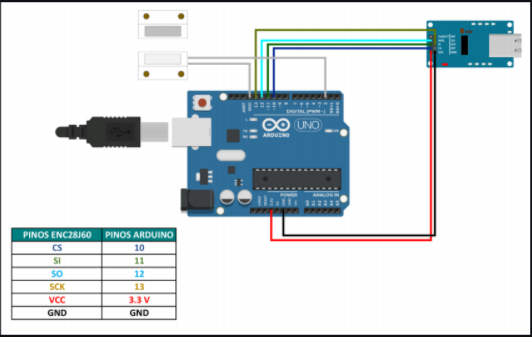

# atividade_Redes_ultimaSprint
## objetivo

* objetivo desse projeto é utilizar um Arduino Uno mais um Sensor Magnético para monitorar se a porta de um Rack
de Rede está ABERTO ou FECHADO; enviar essa informação via Internet utilizando o protocolo MQTT (Message
Queuing Telemetry Transport) para um servidor MQTT hospedado na Amazon Web Service (AWS) e exibir a informação
em um cliente MQTT (MQTT Dash) instalado em um Smartphone, conforme imagem abaixo.

## ultilizando as bibliotecas

* UIPEthernet (conexão do ENC28J60 com o Arduino)
* PubSubClient (cliente MQTT para o Arduino)

## Materiais

* Arduino Uno
* Módulo Ethernet (ENC28J60)
* Sensor Magnético (MC-38)
* Jumpers

## Circuito

 

autor: lucas santos

